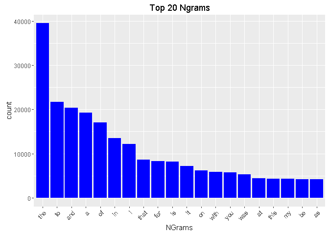
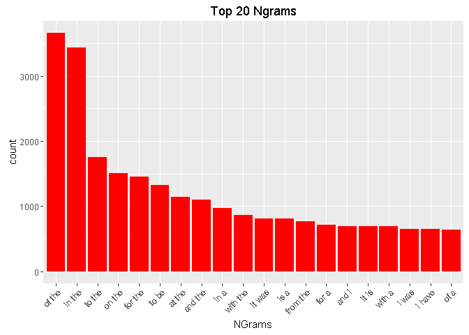
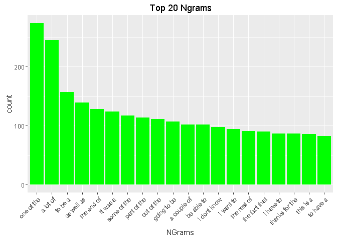

Project Milestone Report

Synopsis
The Data Science Specialization Capstone Project from the Johns Hopkins University
along with Swiftkey requires us to build a language model with a provided dataset.

Such dataset is comprised by data extracted from 3 sources, news, blogs and twitter.

The procedure to develop the language model will consists on:

* Downloading and loading the data.
* Extract basic information of the files (size, number of lines)
* Sample the data, necessary due to the huge size of the datasets.
* Pre-process the data, to have an standardized format of it. 
* Generate ngrams, set(s) of word(s) that will be foundation of the language model.
* Count each unique ngram, recognize popular and unpopular ones.

Download Data
Use the url provided to download the dataset and unzip the files if not already in computer.

```r
url <- "https://d396qusza40orc.cloudfront.net/dsscapstone/dataset/Coursera-SwiftKey.zip"
name <- "Coursera-SwiftKey.zip"
if(!file.exists(name)) {download.file(url=url,destfile=name); unzip(name)}
```


##Loading Data
Move files to current directory and open connections to each one, then load them to memory.

```r
files <- paste0("final/en_US/",dir("final/en_US"))
file.copy(files[1],"blogs.txt"); con <- file("blogs.txt",open="rb"); 
blogs <- readLines(con,encoding="UTF-8"); close(con)
file.copy(files[2],"news.txt"); con <- file("news.txt",open="rb"); 
news <- readLines(con,encoding="UTF-8"); close(con)
file.copy(files[3],"twitter.txt"); con <- file("twitter.txt",open="rb"); 
twitter <- readLines(con,encoding="UTF-8"); close(con);
```


Data Summary
Observe how data looks like, how is it stored, its size in MB and number of lines.

```r
(numbers <- rbind(dir(pattern=".txt"),round(file.size(dir(pattern=".txt"))/2^20),
                  c(length(blogs),length(news),length(twitter))))
```

```
##      [,1]        [,2]       [,3]         
## [1,] "blogs.txt" "news.txt" "twitter.txt"
## [2,] "200"       "196"      "159"        
## [3,] "899288"    "1010242"  "2360148"
```

```r
class(blogs); 
```

```
## [1] "character"
```


Sampling
The datasets, due to their size are processed slowly by the computer, so we will sample them; each one same number of times (in this case the 1% of the min number of lines among them). 

```r
(minLen <- round(min(as.numeric(numbers[3,]))*0.01,0))
```

```
## [1] 8993
```

```r
bInd <- sample(1:numbers[3,1],minLen); bSamp <- blogs[bInd]
nInd <- sample(1:numbers[3,2],minLen); nSamp <- news[nInd]
tInd <- sample(1:numbers[3,3],minLen); tSamp <- twitter[bInd]
```


Preprocessing
Before we explore the datasets, we will preprocess the data to have it in a standard format.
The datasets come from different sources: the tone, choice of words and even length (twitter has a 140 characters cap) are different. Preprocess the samples of the datasets, the process depends on the use and type of analysis and canchange according to what is found and is more suitable. We define a function for such purpose.

```r
pre_process <- function(x,iV=TRUE,dG=TRUE,pC=TRUE,tL=TRUE,sS=1){
        if(iV) x <- iconv(x,"latin1","ASCII","")
        if(dG) x <- gsub("[[:digit:]]+","",x)
        if(pC) x <- gsub("[[:punct:]]+","",x)
        if(tL) x <- tolower(x)
        if(sS==2) x <- paste0("<> ",x," <->")
        if(sS==3) x <- paste0("<<>> <> ",x," <<->>")
        x
}
```
Options:

* Change characters to ASCII.
* Remove digits.
* Remove punctuation.
* Change to lowercase.
* Insert start and stop symbols.

Combine the 3 datasets into 1 and for now preprocess with all the options except the last one.

```r
allpp <- pre_process(c(bSamp,nSamp,tSamp))
```


Tokenization and NGrams

Create 1,2 and 3 grams, that is, groups of contiguous 'n' words. They will help to understand
the structures of the sentences, the most repeated words and groups of words, and their function as links in a chain for the language.

Use the RWeka library which has a function we will utilize, the NGramTokenizer. This function creates a bag of words depending on the specified parameters (the min and max number of words together). Define the ngram function for brevity and further use.

We then have a glimpse of how the data looks like after this applying this functions.


```r
require(RWeka)
```


```r
ngram <- function(x,n) {
        NGramTokenizer(x,Weka_control(min=n,max=n))
} 
ngram_1 <- ngram(allpp,1); ngram_2 <- ngram(allpp,2); ngram_3 <- ngram(allpp,3)
ngram_1[1:3]; ngram_2[1:3]; ngram_3[1:3]
```

```
## [1] "but"  "the"  "move"
```

```
## [1] "but the"     "the move"    "move should"
```

```
## [1] "but the move"    "the move should" "move should be"
```

Lets see basic statistics of the ngrams, particularly the total number of ngrams and the quantity of unique ngrams for each type.

```r
(stats <- as.data.frame(cbind(type_ngram=c("1-gram","2-gram","3-gram"),
        tot_ngrams=c(length(ngram_1),length(ngram_2),length(ngram_3)),
        uniq_ngrams=c(length(unique(ngram_1)),length(unique(ngram_2)),length(unique(ngram_3))))))
```

```
##   type_ngram tot_ngrams uniq_ngrams
## 1     1-gram     782204       49121
## 2     2-gram     755240      364573
## 3     3-gram     728503      623663
```

Next step, obtain the total count for each unique ngram, find which appear the most and thus have the highest probability of being present in text (according to our sampled training set). This in necessry to build the language model. Interesting as well is the presence of ngrams with very low totals, may account for obscenities, typos, foreign language or really rare words.

Define a function to prepare the data, obtain the total count of each ngram and sort them decreasingly. Then apply it to the ngrams data.

```r
tngram <- function(x){
        x <- sort(table(x),decreasing=TRUE)
        x <- as.data.frame(cbind(ngrams=names(x),count=x))
        x$ngrams <- droplevels(x$ngrams)
        x$count <- as.numeric(as.character(x$count))
        x
}
tngram_1 <- tngram(ngram_1); tngram_2 <- tngram(ngram_2); tngram_3 <- tngram(ngram_3)
```


Data overview and visualization

Define a function to take a look at the top occurring ngrams, most common words and groups of words, sort them decreasingly and use a nice color.

```r
require(ggplot2)
```


```r
Nplot <- function(df,n,color,angle=45){
        g <- ggplot(data=df[1:n,]) + aes(x=reorder(ngrams,-count),y=count) + 
        geom_bar(stat="identity",fill=color) + xlab("NGrams") + ggtitle(paste("Top",n,"Ngrams"))
        g + theme(axis.text.x = element_text(angle=angle,hjust=1))
}
Nplot(tngram_1,20,"blue"); Nplot(tngram_2,20,"red"); Nplot(tngram_3,20,"green")
```

   

What is shown? The most popular 1gram is"the" as expected, then some other short words, articles, interjections, pronouns, etc. We also see the range of the count for the 1grams is aproximately 10+ times for the 2grams and about 100+ times for the 3grams. These are the most popular ngrams, now lets see how flat or skewed is the distribution as a whole with the ngrams found only once.
Some techniques for language models use the probability of ngrams found once for the ngrams never found or unknown.


```r
ngram_once <- function(x){
        paste("Ngrams found once:",round(sum(x[,2]==1)/sum(x[,2])*100,2),"%")
}
ngram_once(tngram_1); ngram_once(tngram_2); ngram_once(tngram_3)
```

```
## [1] "Ngrams found once: 3.31 %"
```

```
## [1] "Ngrams found once: 38.74 %"
```

```
## [1] "Ngrams found once: 79.67 %"
```

As we increase the order of the ngram, the distribution becomes flatter, unique combinations are far more common that unique words. 
