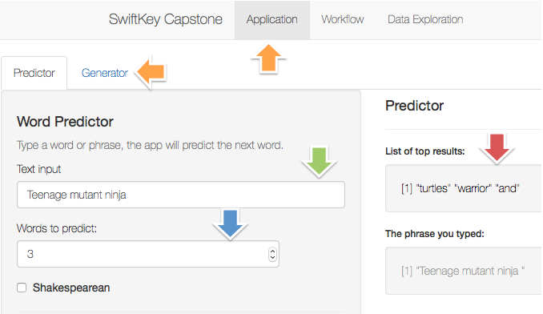
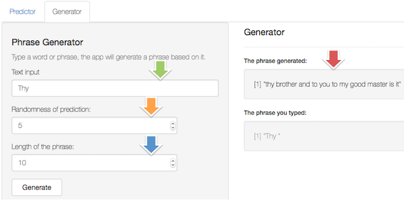

Coursera - SwiftKey
========================================================
transition: fade
class: illustration
rtl: false
navigation: slide
font-family: 'Palatino Linotype'
width: 1024
height: 768
<code><h2>
Capstone Project App  
Natural Language Processing<h2> 

 
 
Luis E Castro
</code>

Prediction app description
========================================================
title: false
type: prompt
<code><justify><h2>Word predictor app</h2>
<small>

Main characteristics:

- Optimized user interface, <b>seamless navigation</b>.
- <b>Immediate data load</b> possible due to processing 583MB of raw data into 16MB.
- Sweetspot of <b>speed & accurancy</b> with up to <b>3grams</b> for prediction.
- Backoff algorithm for <b>best results</b> on user input.
- <b>Easy user customization</b> for displaying results.
- Automatic <b>as you type</b> prediction.

</justify>
 

[Predictor app link](https://luislundquist.shinyapps.io/coursera_capstone/)

</code></small>

Prediction app description
========================================================
title: false
type: prompt
<code><justify><h2>Word predictor app</h2>
<small>

Bonus characteristics:

- Corrector uses Levenshtein distance to provide <b>correction</b> and/or <b>prediction</b> to the <b>currently typed word</b>. 
- <b>Phrase generator</b> additional feature for the user, it allows to <b>create phrases</b> and selecting their length and randomness.
- <b>Shakespearean</b> allows the user to <b>switch back and forth</b> from current English to <b>old fancy English.</b>
- No external libraries, <b>easier to update and patch</b> without depending on 3rd parties, having <b>full access to code</b> and documentation.

</justify>

[Predictor app link](https://luislundquist.shinyapps.io/coursera_capstone/)

</code></small>

Main elements
========================================================
title: false
type: prompt
left: 60%
<code>

<small>

***
  
<b>Predictor

- Navigation tabs

- Results display

- User input

- # of words selection

  
Generator

- User input

- Results display

- Randomness selection

- # of words selection</b>

</small>
</code>

Word prediction app manual
========================================================
title: false
type: prompt
<code>
<h2>Additional information</h2>
<small>

<justify>
- App was developed in RStudio using <b>R, Markdown, Shiny, HTML and a bit of CSS.</b>
- Special thanks to <b>Roger D. Peng, Brian Caffo and Jeff Leek</b> for this amazing course.
- <b>Thank you</b>, that are reading this and helped me thrive through the course.
</justify>

</small></code>
